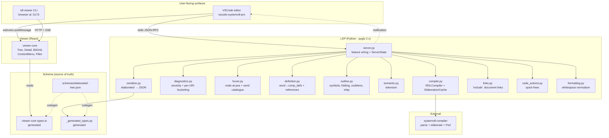
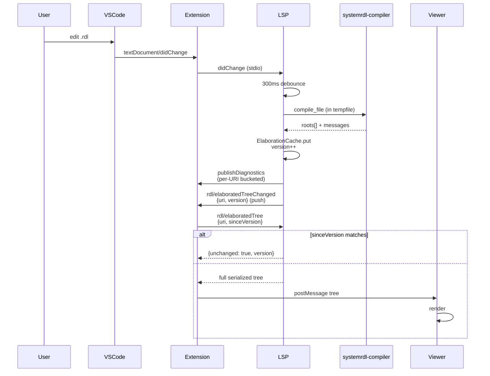
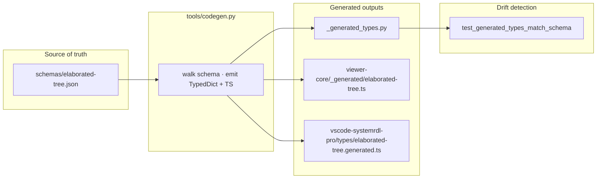
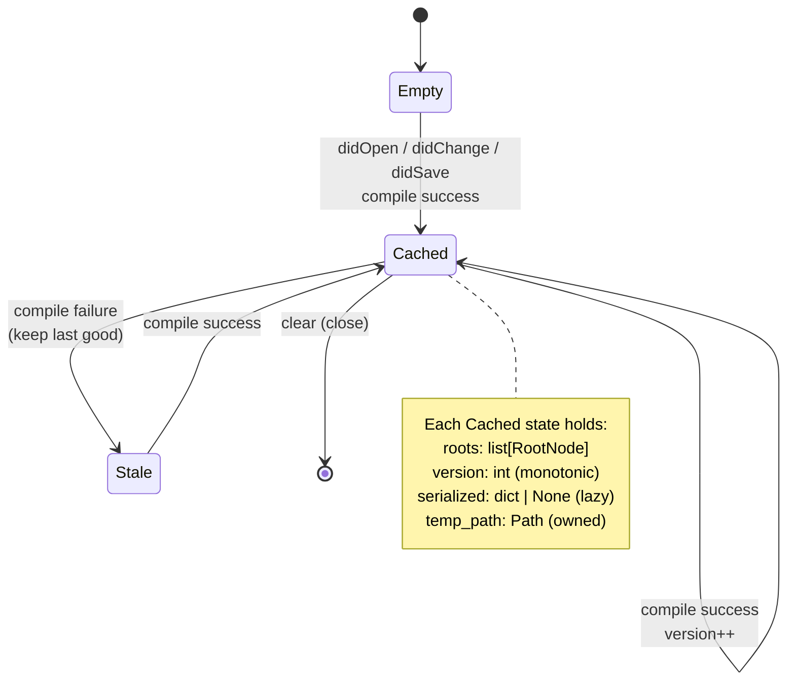

# Architecture

`systemrdl-pro` ships a Python LSP (`systemrdl-lsp`), a shared React viewer
(`@systemrdl-pro/viewer-core`), a VSCode extension (`vscode-systemrdl-pro`),
and a standalone CLI viewer (`rdl-viewer`). All four are workspace packages
that share a single source-of-truth JSON schema for the elaborated tree.

## Component diagram



## Data flow on file edit



## Module responsibilities

### LSP — `packages/systemrdl-lsp/src/systemrdl_lsp/`

| Module | Owns |
|---|---|
| `server.py` | pygls feature registrations, `ServerState`, debounce, restart, config |
| `compile.py` | `_compile_text` (writes tempfile, runs compiler, multi-root elaborate), `ElaborationCache` (per-URI version + serialized cache + temp-file lifecycle), `_resolve_search_paths` (setting + peakrdl.toml + sibling), `_perl_*` helpers |
| `diagnostics.py` | severity mapping, range builders, `_publish_diagnostics` (per-URI bucketed with clear-on-resolve), `_address_conflict_diagnostics` (per top-level addrmap, skips reused-type bodies) |
| `hover.py` | `_node_at_position` (skips reused-type bodies), `_hover_text_for_node`, `_hover_for_word` (catalogues + user types) |
| `definition.py` | `_word_at_position`, `_comp_defs_from_cached`, `_definition_location`, `_references_to_type`, `_rename_locations` |
| `outline.py` | `_document_symbols`, `_workspace_symbols_for_uri`, `_folding_ranges_from_text`, `_inlay_hints_for_addressables` (skips reused-type bodies), `_code_lenses_for_addrmaps` |
| `semantic.py` | `_semantic_tokens_for_text` — pure textual tokenizer, no elaboration dependency |
| `completion.py` | static keyword / property / value catalogues + context detection (`sw =` → access values only) |
| `serialize.py` | elaborated tree → JSON envelope matching `schemas/elaborated-tree.json`. `_unchanged_envelope` for the version-gated fast path |
| `links.py` | `\`include "x.rdl"` → clickable documentLink |
| `code_actions.py` | quick-fix (e.g. "Add `= 0` reset value") |
| `formatting.py` | conservative whitespace formatter (trim trailing, tabs→spaces, single trailing newline) |
| `_uri.py` | URI ↔ filesystem path |

### Viewer — `packages/rdl-viewer-core/src/`

| Module | Owns |
|---|---|
| `index.tsx` | `mount(target, transport)` IIFE entry, hydrates the React root |
| `Viewer.tsx` | top-level component, tab strip, filter, tree+detail layout, cursor sync, copy-clipboard, context menu |
| `Tree.tsx` | flat-list tree with collapsible containers, caret-toggle button, filter highlighting, scroll-to-top |
| `Detail.tsx` | per-register detail pane: address/width/reset/access summary + bit grid + per-field breakdown |
| `BitGrid.tsx` | datasheet-style bit layout — 16-bit-per-row, multi-line field names, access-colour fill |
| `ContextMenu.tsx` | right-click overlay with Copy Name / Address / Type / Reveal-in-Editor |
| `types.ts` | re-exports `_generated/elaborated-tree.ts` + viewer-only `Transport` and `TreeNode` unions |
| `util.ts` | filter scope helpers, find-by-key, find-first-reg |
| `styles.css` | CSS tokens (light/dark via `prefers-color-scheme`), all viewer chrome |

### Transport contract

```typescript
type Transport = {
  getTree(): Promise<ElaboratedTree>;
  onTreeUpdate(cb: (tree: ElaboratedTree) => void): () => void;
  onCursorMove?(cb: (line0b: number) => void): () => void;
  reveal?(source: SourceLoc): void;
  copy?(text: string, label?: string): void;
};
```

Two implementations:

- **VSCode webview** (extension.ts) — `vscode.postMessage` round-trip.
- **CLI viewer** (rdl-viewer-cli) — HTTP fetch + SSE push, no `reveal` / no `copy`.

The viewer-core knows nothing about either; it sees only this contract.

### VSCode extension — `packages/vscode-systemrdl-pro/src/extension.ts`

| Concern | What it does |
|---|---|
| **LSP supervisor** | Spawns Python, restarts up to 3× in 60 s on crash, surfaces banner past the cap |
| **Python resolution** | `systemrdl-pro.pythonPath` → `ms-python.python` interpreter → `python3`/`python` on PATH |
| **Memory map panels** | One `WebviewPanel` per `.rdl` URI (markdown-preview-style), `Map<uri, PanelEntry>` |
| **Push refresh** | Listens for `rdl/elaboratedTreeChanged`, calls `refreshMemoryMap(uri)` with `sinceVersion` |
| **Cursor → viewer** | `onDidChangeTextEditorSelection` debounces and posts cursor line to the active panel |
| **Reveal in editor** | postMessage `reveal` → opens document, scrolls range into view, 200 ms flash decoration |
| **Status bar** | `$(circuit-board) N regs · root_names · diag counts` updated on diagnostics + cursor move |

## Schema-driven types (Decision 9A)



`bun run codegen` re-runs the generator. CI tests assert no diff against the
committed files, so a schema edit without regen breaks the build.

## Cache + version contract (TODO-1 push protocol)



`rdl/elaboratedTree` request flow:

- Client passes `sinceVersion`. If matches → `{unchanged: true, version}` (constant size).
- If not → reuse `cached.serialized` if populated, else serialize + cache.
- On compile success → push `rdl/elaboratedTreeChanged` notification with the new `version`.

## Conventions

- **Tooling**: `uv` for Python, `bun` for TS. Both have workspace configs at the repo root.
- **Schema-driven types**: edit `schemas/elaborated-tree.json` first, then `bun run codegen`.
- **Commits**: Conventional Commits. Stage specific files (no `git add -A` for shared paths).
- **Design tokens**: defined as CSS variables in `viewer-core/styles.css`. Never hardcode access-mode colours.
- **Multi-root files**: each top-level `addrmap` becomes its own elaborated `RootNode`, gets its own viewer tab. Address conflicts are scoped per top-level addrmap.
- **Reused types**: when a `regfile`/`reg` type is instantiated more than once, its body lines are re-played in the elaborated tree. Hover, inlay-hints, and address-conflict diagnostics all skip those lines (heuristic: count of elaborated nodes per source line > 1) so we never paint a single absolute address on a multi-instance template.
